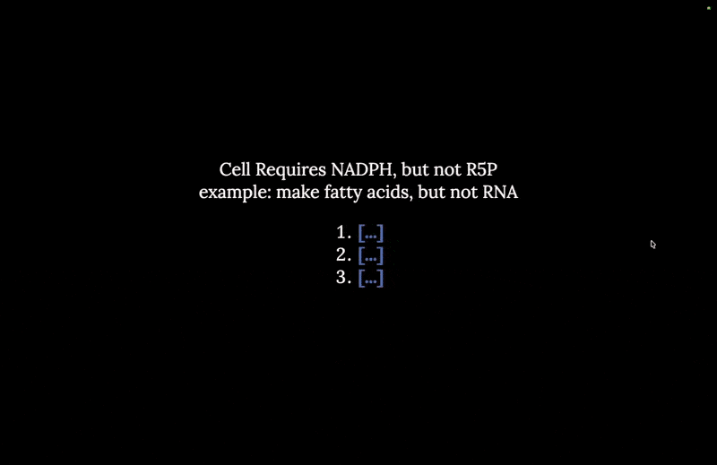

# A Quick-Access Metabolic Pathway Viewer.

A tiny native AppKit/SwiftUI/PDFKit viewer for a local copy of the Stanford
Pathways of Human Metabolism PDF. It lives in the menu bar, pops the map
open (or over any full-screen app) with a global hotkey, and adds fast find,
zoom, pan, and a cursor "peek-through" so you can glance at what's behind it.

> [!NOTE]
> The PDF is NOT included. Please download from [**here**](https://mededucation.stanford.edu/pathways-download/).
> On first launch the app asks you to pick your local copy and remembers it;
> Options also has a **Download Stanford Map** link and a **Change Map PDF** button.



## Download

Grab the prebuilt app from the
[latest release](https://github.com/cjreplogle/metabolic-map-hotkey/releases/latest):

1. Download `MetabolicMap.zip`, unzip, and move `MetabolicMap.app` to Applications.
2. First launch: right-click the app → **Open** (it's signed with a personal
   Apple Development certificate and isn't notarized, so Gatekeeper warns once).
3. Pick your local map PDF when prompted.
4. Grant Accessibility (below) so the global hotkeys work.

Requires macOS 14+.

## Permissions

The global shortcuts use a keyboard event tap, which macOS gates behind:

**System Settings → Privacy & Security → Accessibility**

Enable **MetabolicMap** there. The app polls for the permission, so it starts
working the moment you toggle it on — no relaunch needed.

## Shortcuts

Global (work from any app; ⌥⌘M / ⌥⌘S are rebindable in Options → Shortcuts):

- **⌥⌘M**  show the map (without stealing focus) / hide it when it's frontmost
- **⌥⌘S**  show the map and open the find bar
- **⌥⌘→**  pan the map
- **⌃⌘→**  snap the window across a 3×3 grid of screen positions
- **⌥⌘ +/−**  zoom the map in / out
- **⌃⌘ +/−**  resize the window (anchored top-right)
- **⌥⌘B**  return focus to the app you were using before

With the map focused:
- **click+drag** — pan (grab)
- **⌘-drag** — move the window
- **trackpad scroll** - pan

## Features

- Menu-bar app with a live glucose→TCA metabolite icon that walks the pathway.
- Shows over full-screen Spaces; optional **Always on Top**; **Launch at Login**.
- Cover-fit rendering (no gray letterbox), with a low-res underlay so panning/
  zooming doesn't flash white.
- **Peek-through**: hover near the window and a soft, adjustable circular hole
  lets you read whatever is behind it (fades out while the window is focused).
- Adjustable **base transparency**; frameless rounded window; remembers your last
  zoom/scroll position.
- Built-in **update check** with one-click self-update (Options footer).

All settings live in the tray menu's **Options…** window (General, Shortcuts,
and Animation tabs).

## Build from source

Requires macOS + Xcode Command Line Tools.

```bash
./build.sh
```

`build.sh` compiles `MetabolicMapApp.swift`, generates the app icon and
`Info.plist`, and code-signs with a stable identity (so the Accessibility grant
survives rebuilds). If macOS reports `zsh: permission denied: ./build.sh`, run
`chmod +x build.sh` once first. Then launch `MetabolicMap.app`.

## Note

This project does not bundle or redistribute the Stanford metabolic-map PDF; it
only views a copy you already have.

[cjre.pl/ogle](https://cjre.pl/ogle/plain)
